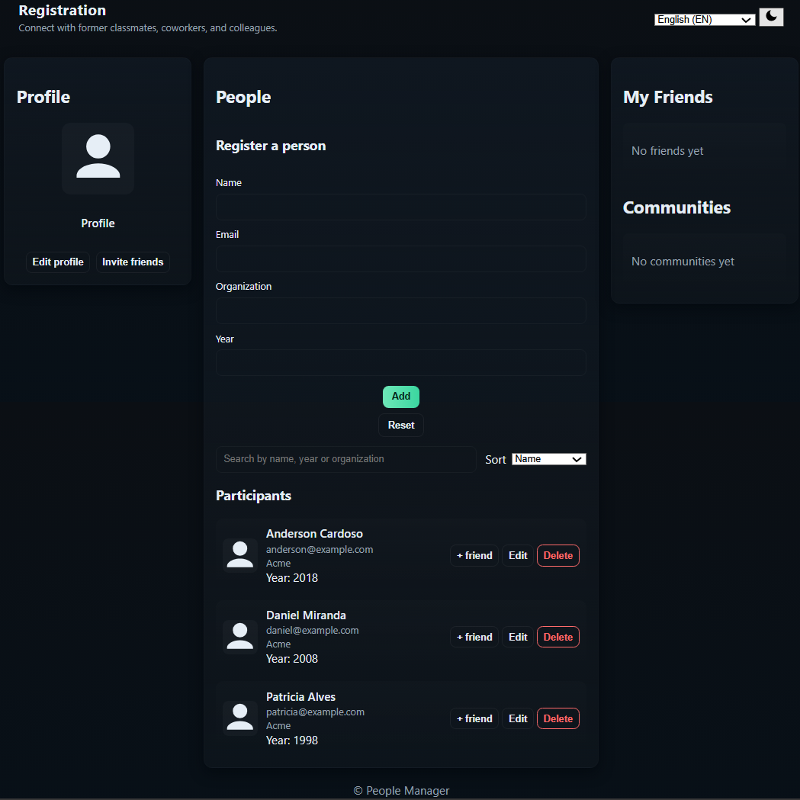

# Developing a people management system via REST API with Spring Boot

Project developed during the Digital Innovation One Java Developer Bootcamp under the guidance of expert [Rodrigo Peleias](https://github.com/rpeleias "Rodrigo Peleias").
Learning to build a REST API from scratch using Spring Boot to register and manage an organization's personnel, all the way to cloud deployment (Heroku). Practicing key concepts of the REST architectural style.

## Features

- Create, edit, and delete people.
- Simple search and sorting.
- **Dark / light** mode with moon/sun icons.
- Multilingual: **English (default)**, **Portuguese (PT-BR)**, **Spanish**.
- Accessibility: labels, `aria-*` attributes, visible focus, `aria-live` for the list.
- Responsive: works on desktop, tablet, and smartphone.
- Local storage via `localStorage`.

## How to use

1. Open `index.html` in your browser (double-click or `Ctrl+O`).
2. Use the form to add people. Edit or delete using the buttons in the list.
3. Switch languages ​​using the selector and themes using the moon/sun button.

## Technologies used

### Back-end

- **Java** - robust programming language for developing business logic.
- **Spring Boot** - framework for creating the REST API, facilitating dependency injection and service management.

### Front-end

- **HTML** - semantic markup and structure.
- **CSS** - styles, variables for themes, and responsiveness.
- **JavaScript** - CRUD logic, multilingual support, and data persistence.

## Accessibility and best practices

- All fields have labels.
- Interactive elements are native buttons.
- `aria-live` used for dynamic list updates.
- Contrast and visible focus for keyboard navigation.

## Customization

- To change the default language, edit `state.lang` in `script.js`. - To remove the sample data, clear `initDefaults()` or delete `localStorage` in the browser.

[LICENSE](/LICENSE)
